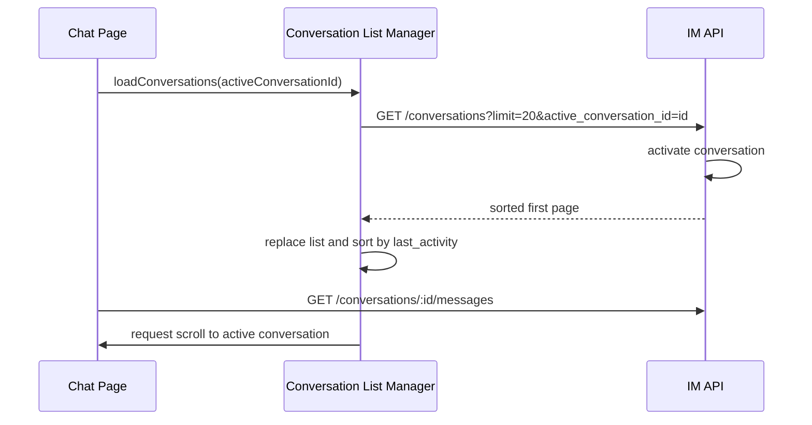

# 会话列表排序与激活交互设计

本文档记录 d-im 会话列表的排序、选中、搜索进入、业务系统直达等交互规则。后续在 Flutter App 中实现 IM 页面时，可以按这里的职责边界复刻，避免把路由切换、会话列表排序、未读处理混在一起。

## 目标

会话列表需要满足几个基础体验：

- 从业务系统直接进入某个会话时，该会话必须出现在当前用户会话列表中，并能滚动定位到它。
- 从搜索结果点击一个旧会话时，如果用户接下来可能要聊天，该会话应该稳定排到前面；刷新后也不丢失这个意图。
- 普通点击左侧已有会话时，只是切换当前聊天，不应该额外触发排序重排。
- 新消息到来或自己发送消息后，会话按最后消息时间自动重排。
- 未读数的清理时机独立处理，不跟“激活会话”绑定。

核心原则：**会话排序字段由服务端提供，前端只做展示、合并和滚动定位。**

## 概念

### 当前会话

当前会话指页面或 App 当前正在查看的 `conversation_id`。它是 UI 状态，可以来自：

- 会话列表点击
- 搜索结果点击
- 业务系统 SSO 直达
- 路由或页面参数恢复

切换当前会话本身不等于修改排序。

### 激活会话

激活会话用于记录“用户最近明确表达了要使用这个会话”的意图。服务端记录到当前用户视角的状态：

```json
{
  "user_states": {
    "user_a": {
      "last_activated_at": "2026-06-25T10:00:00Z",
      "last_read_at": "...",
      "unread_count": 0
    }
  }
}
```

激活只影响排序字段，不处理未读数。

### 排序字段

服务端返回 `last_activity`，当前实现为以下时间的最大值：

- `last_message.created_at`
- `user_states.<current_user_id>.last_activated_at`
- `updated_at`

前端按 `last_activity` 倒序展示。

## 后端接口

### 会话列表

```http
GET /im/api/conversations?limit=20&cursor=...&active_conversation_id=...
```

参数说明：

| 参数 | 说明 |
|------|------|
| `limit` | 每页数量，默认 20 |
| `cursor` | 游标分页 |
| `q` | 搜索关键词 |
| `active_conversation_id` | 当前需要确保出现在首屏的会话 ID |

当 `active_conversation_id` 存在、没有 `cursor`、没有 `q` 时，服务端先对该会话执行激活，再返回第一页列表。因为激活会更新 `last_activated_at`，这个会话会按服务端排序稳定进入第一页。

### 激活会话

```http
POST /im/api/conversations/:id/activate
```

使用场景：

- 搜索结果点击到一个会话，但当前普通列表中还没有它。
- 当前页面直达某个会话，但首屏列表请求没有覆盖到它。

不建议在普通列表中点击已存在会话时调用该接口，否则每次点击都会触发重排，体验会变得飘。

## 前端职责

前端应拆成三层：

| 层 | 职责 |
|----|------|
| 页面路由层 | 只负责当前 `conversation_id` 的切换 |
| 会话列表管理器 | 管理列表、分页、搜索、合并、排序、确保会话存在 |
| UI 组件层 | 渲染列表、高亮当前会话、触发滚动定位 |

不要在会话列表 item 的点击事件里直接处理“打开/激活/拉详情/排序”全套逻辑。点击只表达“切换当前会话”。

## 推荐流程

### 首次进入聊天页



### 点击普通列表中已有会话

1. UI 切换当前 `conversation_id`。
2. 页面拉取该会话消息。
3. 列表不调用 `activate`，不主动重排。
4. 如果点击的是已选中会话，可以清空当前会话，显示空白聊天页。

### 点击搜索结果

1. UI 切换当前 `conversation_id`。
2. 管理器检查普通会话列表是否已有该会话。
3. 如果已有，只滚动定位。
4. 如果没有，调用 `POST /conversations/:id/activate`。
5. 将返回的会话合并进普通列表。
6. 按 `last_activity` 排序后滚动定位。

### 发送或收到新消息

1. 消息进入当前消息列表。
2. 管理器用消息更新对应会话的 `last_message`。
3. 本地把该会话的 `last_activity` 更新为消息时间。
4. 会话列表自动重排到最新消息位置。

这里的重排来自“真实消息活动”，不是来自普通点击。

## 未读数规则

未读数和激活会话分离。

推荐规则：

- 收到非当前会话的新消息：未读数 +1。
- 当前会话收到新消息并成功标记已读：清空该会话本地未读。
- 进入会话后拉取历史消息并标记已读：清空该会话本地未读。
- `activate` 不清理未读数。

后续可以增加会话级已读接口，例如：

```http
PUT /im/api/conversations/:id/read
```

这样会比逐条消息标记已读更适合 App 端。

## Flutter 实现建议

Flutter 端建议建一个独立的会话列表控制器，例如 `ConversationListController`、`ConversationListBloc` 或 Riverpod `Notifier`。

它至少维护：

```dart
class ConversationListState {
  final List<Conversation> conversations;
  final bool loading;
  final bool loadingMore;
  final String? nextCursor;
  final bool hasMore;
  final String? pendingScrollConversationId;
}
```

核心方法：

```dart
Future<void> loadFirstPage({String? activeConversationId});
Future<void> loadMore();
Future<Conversation?> ensureConversationInList(
  String conversationId, {
  bool activateIfMissing = false,
});
void upsertConversation(Conversation conversation);
void applyIncomingMessage(Message message, {String? activeConversationId});
void requestScrollToConversation(String conversationId);
```

Flutter 页面只做：

- 监听当前 `conversationId`
- 调用 `loadFirstPage(activeConversationId: conversationId)` 或 `ensureConversationInList`
- 拉取当前会话消息
- 根据 controller 的 `pendingScrollConversationId` 调用 `Scrollable.ensureVisible`

## 易错点

- 不要用 `updated_at` 直接当列表排序字段。搜索到旧会话时会排在很后面，容易触发分页加载和定位错乱。
- 不要在普通列表每次点击时调用激活接口。否则用户来回点几个会话，列表会不断重排。
- 不要把未读数清理放到激活接口里。激活表达“我要看/可能要聊”，已读表达“消息已被消费”。
- 不要让前端改服务端返回的时间字段来伪造排序。刷新后状态会丢失，也会导致 Web、App 多端不一致。
- 搜索结果和普通列表要分开管理。搜索结果点击后，再把目标会话合并进普通列表。

## 当前实现对应关系

| 能力 | 当前位置 |
|------|----------|
| 会话状态字段 | `user_states.<user_id>.last_activated_at` |
| 排序返回字段 | `last_activity` |
| 会话列表接口 | `GET /im/api/conversations` |
| 激活接口 | `POST /im/api/conversations/:id/activate` |
| 前端列表管理 | `im-frontend/src/stores/conversationList.ts` |
| 前端薄包装 | `im-frontend/src/composables/useConversationList.ts` |
| Go SDK 方法 | `ActivateConversation`、`ListConversations` |

