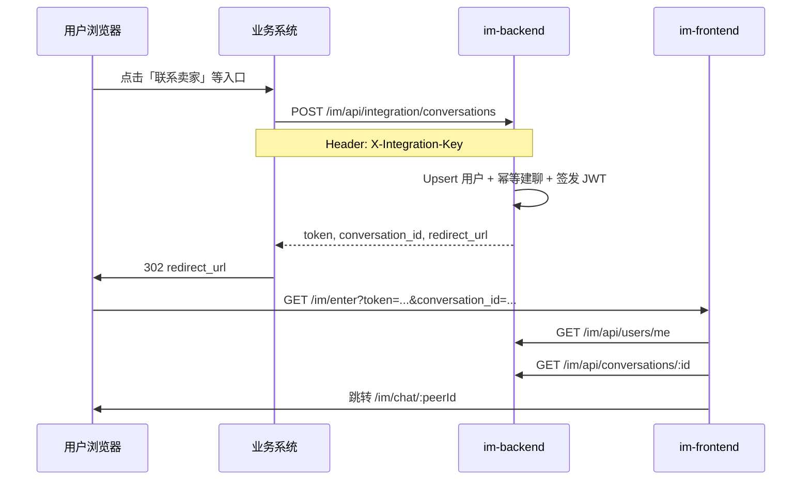

# IM 业务系统集成指南

d-im 作为嵌入式 IM 模块：**不提供独立登录注册**。业务系统在服务端调用 integration 接口，获得临时 JWT 与跳转链接，再将用户浏览器重定向到 IM 前端 SSO 回调页。

支持两种入口：

| 场景 | 接口 | 落地页 |
|------|------|--------|
| 进入会话列表 | `POST /im/api/integration/login` | `/im/home` |
| 进入指定单聊 | `POST /im/api/integration/conversations` | `/im/chat/:peerId` |

## 架构概览



## 环境变量

### im-backend

| 变量 | 说明 |
|------|------|
| `JWT_SECRET` | HS256 签名密钥（足够长的随机字符串） |
| `JWT_EXPIRE` | Access Token 有效期（`time.ParseDuration` 格式，如 `1h`、`30m`），默认 `1h` |
| `JWT_REFRESH_EXPIRE` | Refresh Token 有效期（`time.ParseDuration` 格式，如 `168h`、`168h`），默认 `168h`；通常不大于 `JWT_MAX_SESSION` |
| `JWT_MAX_SESSION` | 绝对会话上限（`time.ParseDuration` 格式，如 `168h`），超过后须重新从业务系统进入 |
| `JWT_ISSUER` | JWT issuer，默认 `d-im` |
| `JWT_REFRESH_COOKIE_NAME` | Refresh Token Cookie 名称，默认 `d_im_refresh_token` |
| `JWT_REFRESH_COOKIE_DOMAIN` | Refresh Token Cookie 域名，默认当前域 |
| `JWT_REFRESH_COOKIE_SECURE` | 生产环境建议设为 `true` |
| `JWT_REFRESH_COOKIE_SAMESITE` | `Lax` / `Strict` / `None`，默认 `Lax` |
| `INTEGRATION_API_KEY` | 业务服务端调用创建会话接口的密钥 |
| `IM_FRONTEND_BASE_URL` | 前端基址，用于拼接 `redirect_url` |
| `MONGODB_URI` / `MONGODB_DATABASE` | MongoDB 连接 |
| `API_SERVER_PORT` | REST API 端口（默认 8080） |
| `WS_SERVER_PORT` | WebSocket 端口（单进程 `cmd/server` 时与 API 同端口） |

示例见 [im-backend/.env.example](../im-backend/.env.example)。

### im-frontend（开发）

| 变量 | 说明 |
|------|------|
| `VITE_IM_API_BASE` | API 基址，开发环境通常为 `/`（由 Vite proxy 转发） |

Vite 开发代理（见 [im-frontend/vite.config.ts](../im-frontend/vite.config.ts)）：

- `/im/api` → `http://localhost:8901`
- `/im/ws` → `ws://localhost:8902`

## 创建会话接口

**路径：** `POST /im/api/integration/conversations`

**鉴权：** Header `X-Integration-Key: <INTEGRATION_API_KEY>`（仅业务服务端持有，不可暴露到浏览器）

**请求体：**

```json
{
  "from_user": {
    "id": "user_a",
    "nickname": "买家张三",
    "avatar": "https://cdn.example.com/a.jpg"
  },
  "to_user": {
    "id": "user_b",
    "nickname": "卖家李四",
    "avatar": "https://cdn.example.com/b.jpg"
  }
}
```

- `from_user`：即将进入 IM 的当前用户（JWT `sub` 为其 `id`）
- `to_user`：会话对方
- 双方均需传入 `id`、`nickname`；头像使用 `avatar`（也兼容 `avatar_url`）
- `from_user.id` 必须等于业务系统当前登录用户 ID
- `from_user.id` 与 `to_user.id` 不能相同

**成功响应（200）：**

```json
{
  "code": 200,
  "message": "success",
  "data": {
    "token": "eyJhbGciOiJIUzI1NiIs...",
    "conversation_id": "507f1f77bcf86cd799439011",
    "redirect_url": "http://localhost:5173/im/enter?token=eyJ...&conversation_id=507f1f77bcf86cd799439011"
  }
}
```

| 字段 | 说明 |
|------|------|
| `token` | 短期登录 JWT，`sub` = `from_user.id`，算法 HS256 |
| `conversation_id` | 单聊会话 MongoDB ObjectId（hex） |
| `redirect_url` | 业务系统应对用户浏览器 **302** 到此 URL |

**curl 示例：**

```bash
curl -X POST http://localhost:8901/im/api/integration/conversations \
  -H "Content-Type: application/json" \
  -H "X-Integration-Key: change-me-integration-key" \
  -d '{
    "from_user": {"id": "user_a", "nickname": "买家", "avatar": ""},
    "to_user": {"id": "user_b", "nickname": "卖家", "avatar": ""}
  }'
```

## SSO 登录（会话列表）

业务用户从「消息中心」等入口进入 IM 会话列表时使用此接口，**无需**传入对方用户。

**路径：** `POST /im/api/integration/login`

**鉴权：** 同创建会话，`X-Integration-Key`

**请求体：**

```json
{
  "user": {
    "id": "user_a",
    "nickname": "买家张三",
    "avatar": "https://cdn.example.com/a.jpg"
  }
}
```

**成功响应（200）：**

```json
{
  "code": 200,
  "message": "success",
  "data": {
    "token": "eyJhbGciOiJIUzI1NiIs...",
    "expires_in": 3600,
    "redirect_url": "http://localhost:5173/im/enter?token=eyJ..."
  }
}
```

`redirect_url` 不含 `conversation_id`；前端 `/im/enter` 落库 token 后跳转 `/im/home`。

**curl 示例：**

```bash
curl -X POST http://localhost:8901/im/api/integration/login \
  -H "Content-Type: application/json" \
  -H "X-Integration-Key: change-me-integration-key" \
  -d '{"user":{"id":"user_a","nickname":"买家","avatar":"https://cdn.example.com/a.jpg"}}'
```

本地脚本：`temp/login_im_home.sh`

## JWT 规范

| 项 | 值 |
|----|-----|
| 算法 | HS256 |
| 密钥 | `JWT_SECRET`（仅 im-backend 持有） |
| 用户标识 | 标准 claim `sub` = 用户 ID |
| 签发方 | im-backend（创建会话时） |
| 校验 | 所有 `/im/api/*`（integration 与 `auth/exchange`、`auth/refresh`、`auth/logout` 除外）及 `/im/ws` |

## 会话续期（Access + Refresh Token）

用户从业务系统进入 IM 后，前端会先用 URL 中的短期 access token 调用 `exchange` 建立浏览器会话，随后由 `HttpOnly` refresh cookie 负责续期，无需业务系统重复签发 JWT。

| 项 | 说明 |
|----|------|
| Access Token TTL | `JWT_EXPIRE`（默认 `1h`，建议 `15m`～`30m`） |
| Refresh Token 介质 | `HttpOnly + Secure + SameSite` Cookie |
| Refresh Token TTL | `JWT_REFRESH_EXPIRE`（如 `168h`、`168h`），且不会超过 `JWT_MAX_SESSION` |
| 绝对会话上限 | `JWT_MAX_SESSION`（默认 `168h`），自首次登录 `iat` 起算 |
| 建立会话 | `POST /im/api/auth/exchange`（Bearer 入口 access token，返回新 access token 并写入 refresh cookie） |
| 续期接口 | `POST /im/api/auth/refresh`（仅依赖 refresh cookie，轮换 refresh token 并返回新 access token） |
| 登出接口 | `POST /im/api/auth/logout`（清理 refresh cookie 并撤销当前会话） |
| 前端策略 | 启动时尝试 silent refresh；按 access token `exp` 精确定时刷新；页面重新可见时补偿刷新；401 时强制 refresh 并重试一次；多标签页通过 `BroadcastChannel` 同步 |

续期后返回：

```json
{
  "code": 200,
  "message": "success",
  "data": {
    "token": "eyJ...",
    "expires_in": 3600
  }
}
```

超过 `JWT_MAX_SESSION` 时续期返回 401，用户需从业务系统重新进入。

## 前端 SSO 流程

1. 用户打开 `redirect_url`（路由 `/im/enter`）
2. 前端读取 query `token`（及可选的 `conversation_id`）
3. 调用 `POST /im/api/auth/exchange`，用该 access token 建立浏览器会话并写入 refresh cookie
4. 前端保存返回的新 access token 到内存，调用 `GET /im/api/users/me`
5. **无 `conversation_id`**：`router.replace` 到 `/im/home`（会话列表）
6. **有 `conversation_id`**：拉取会话、解析对方 ID，跳转 `/im/chat/:peerId`
7. 从 URL 移除 token，初始化 WebSocket

无 token 时访问 IM 会展示「请从业务系统进入」提示页（`/im/login`）。

## 用户资料 API

| 接口 | 说明 |
|------|------|
| `GET /im/api/users/me` | 当前 JWT 用户（需 Bearer token） |
| `GET /im/api/users/:id` | 指定用户资料 |

用户资料在创建会话时 upsert 到 IM 本地 `user` 集合；前端统一从 IM API 读取，不调用业务 `/api/used/*`。

## 单聊幂等

相同两人 `(a,b)` 与 `(b,a)` 通过 `hash_id` 映射到 **同一会话 ID**。重复调用创建会话接口会更新用户资料并返回同一 `conversation_id`。

## 业务系统需实现

1. **进入会话列表**：调用 `POST /im/api/integration/login`，传入当前登录用户 `user`
2. **进入指定单聊**：调用 `POST /im/api/integration/conversations`，传入 `from_user` / `to_user`
3. 两类接口均需携带 `X-Integration-Key`（仅服务端持有）
4. 收到响应后，将当前登录用户浏览器 **302 到 `redirect_url`**
5. Token 超过绝对会话上限（`JWT_MAX_SESSION`）时，需重新调用对应 integration 接口获取新链接

## 安全注意事项

- `INTEGRATION_API_KEY` 仅业务服务端持有
- `redirect_url` 中的 token 仅用于首屏换取浏览器会话；enter 页完成 `exchange` 后应立即从地址栏清除
- refresh token 仅保存在 `HttpOnly` Cookie，不落地到 `localStorage`
- 生产环境使用 HTTPS；WebSocket `CheckOrigin` 应限制为 `IM_FRONTEND_BASE_URL` 域名
- 可选：限制 integration 接口来源 IP 或 mTLS

## 本地联调

```bash
# 1. 启动 MongoDB，执行 migrate 建索引
cd im-backend && go run ./cmd/migrate

# 2. 配置 .env（复制 .env.example，API_SERVER_PORT=8901、WS_SERVER_PORT=8902）
# 3. 分别启动 API 与 WS（或开发时用 cmd/server 单进程）
go run ./cmd/api-server   # :8901
go run ./cmd/ws-server    # :8902

# 4. 启动前端
cd ../im-frontend && npm run dev

# 5. 一键创建会话并打开 enter 页
cd .. && bash scripts/example.sh
```
