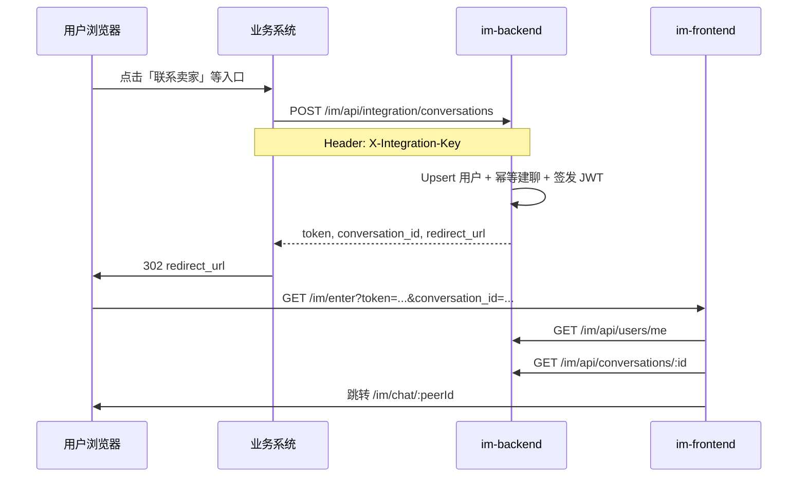

# IM 业务系统集成指南

d-im 作为嵌入式 IM 模块：**不提供独立登录注册**。业务系统在服务端调用「创建会话」接口，获得临时 JWT 与跳转链接，再将用户浏览器重定向到 IM 前端 SSO 回调页。

## 架构概览



## 环境变量

### im-backend

| 变量 | 说明 |
|------|------|
| `JWT_SECRET` | HS256 签名密钥（足够长的随机字符串） |
| `JWT_EXPIRE` | Token 有效期（秒），建议 900～3600 |
| `JWT_ISSUER` | JWT issuer，默认 `d-im` |
| `INTEGRATION_API_KEY` | 业务服务端调用创建会话接口的密钥 |
| `IM_FRONTEND_BASE_URL` | 前端基址，用于拼接 `redirect_url` |
| `MONGODB_URI` / `MONGODB_DATABASE` | MongoDB 连接 |
| `API_SERVER_PORT` | REST API 端口（默认 8080） |
| `WS_SERVER_PORT` | WebSocket 端口（单进程 `cmd/server` 时与 API 同端口） |

示例见 [im-backend/.env.example](../im-backend/.env.example)。

### im-frontend（开发）

| 变量 | 说明 |
|------|------|
| `VITE_IM_API_BASE` | API 基址，开发环境通常为 `/`（由 Vite proxy 转发） |

Vite 开发代理（见 [im-frontend/vite.config.ts](../im-frontend/vite.config.ts)）：

- `/im/api` → `http://localhost:8080`
- `/im/ws` → `ws://localhost:8080`

## 创建会话接口

**路径：** `POST /im/api/integration/conversations`

**鉴权：** Header `X-Integration-Key: <INTEGRATION_API_KEY>`（仅业务服务端持有，不可暴露到浏览器）

**请求体：**

```json
{
  "from_user": {
    "id": "user_a",
    "nickname": "买家张三",
    "avatar": "https://cdn.example.com/a.jpg"
  },
  "to_user": {
    "id": "user_b",
    "nickname": "卖家李四",
    "avatar": "https://cdn.example.com/b.jpg"
  }
}
```

- `from_user`：即将进入 IM 的当前用户（JWT `sub` 为其 `id`）
- `to_user`：会话对方
- `from_user.id` 必须等于业务系统当前登录用户 ID
- `from_user.id` 与 `to_user.id` 不能相同

**成功响应（200）：**

```json
{
  "code": 200,
  "message": "success",
  "data": {
    "token": "eyJhbGciOiJIUzI1NiIs...",
    "conversation_id": "507f1f77bcf86cd799439011",
    "redirect_url": "http://localhost:5173/im/enter?token=eyJ...&conversation_id=507f1f77bcf86cd799439011"
  }
}
```

| 字段 | 说明 |
|------|------|
| `token` | 短期登录 JWT，`sub` = `from_user.id`，算法 HS256 |
| `conversation_id` | 单聊会话 MongoDB ObjectId（hex） |
| `redirect_url` | 业务系统应对用户浏览器 **302** 到此 URL |

**curl 示例：**

```bash
curl -X POST http://localhost:8080/im/api/integration/conversations \
  -H "Content-Type: application/json" \
  -H "X-Integration-Key: change-me-integration-key" \
  -d '{
    "from_user": {"id": "user_a", "nickname": "买家", "avatar": ""},
    "to_user": {"id": "user_b", "nickname": "卖家", "avatar": ""}
  }'
```

## JWT 规范

| 项 | 值 |
|----|-----|
| 算法 | HS256 |
| 密钥 | `JWT_SECRET`（仅 im-backend 持有） |
| 用户标识 | 标准 claim `sub` = 用户 ID |
| 签发方 | im-backend（创建会话时） |
| 校验 | 所有 `/im/api/*`（integration 除外）及 `/im/ws` |

## 前端 SSO 流程

1. 用户打开 `redirect_url`（路由 `/im/enter`）
2. 前端读取 query `token`、`conversation_id`
3. 写入本地 token，调用 `GET /im/api/users/me`
4. 调用 `GET /im/api/conversations/:conversation_id` 解析对方用户 ID
5. `router.replace` 到 `/im/chat/:peerId`，**从 URL 移除 token**
6. 初始化 WebSocket（`/im/ws?token=...`）

无 token 时访问 IM 会展示「请从业务系统进入」提示页（`/im/login`）。

## 用户资料 API

| 接口 | 说明 |
|------|------|
| `GET /im/api/users/me` | 当前 JWT 用户（需 Bearer token） |
| `GET /im/api/users/:id` | 指定用户资料 |

用户资料在创建会话时 upsert 到 IM 本地 `user` 集合；前端统一从 IM API 读取，不调用业务 `/api/used/*`。

## 单聊幂等

相同两人 `(a,b)` 与 `(b,a)` 通过 `hash_id` 映射到 **同一会话 ID**。重复调用创建会话接口会更新用户资料并返回同一 `conversation_id`。

## 业务系统需实现

1. 服务端调用 `POST /im/api/integration/conversations`，携带 `X-Integration-Key`
2. 请求体传入准确的 `from_user` / `to_user`（id 与业务库一致）
3. 收到响应后，将当前登录用户浏览器 **302 到 `redirect_url`**
4. Token 过期时重新调用创建会话接口获取新链接（IM 不提供业务侧登录页）

## 安全注意事项

- `INTEGRATION_API_KEY` 仅业务服务端持有
- `redirect_url` 中的 token 为短期 JWT；enter 页落地后应从地址栏清除
- 生产环境使用 HTTPS；WebSocket `CheckOrigin` 应限制为 `IM_FRONTEND_BASE_URL` 域名
- 可选：限制 integration 接口来源 IP 或 mTLS

## 本地联调

```bash
# 1. 启动 MongoDB，执行 migrate 建索引
cd im-backend && go run ./cmd/migrate

# 2. 配置 .env（复制 .env.example）
# 3. 启动 API + WS
go run ./cmd/server

# 4. 启动前端
cd ../im-frontend && npm run dev

# 5. 调用 integration 接口，浏览器打开返回的 redirect_url
```
